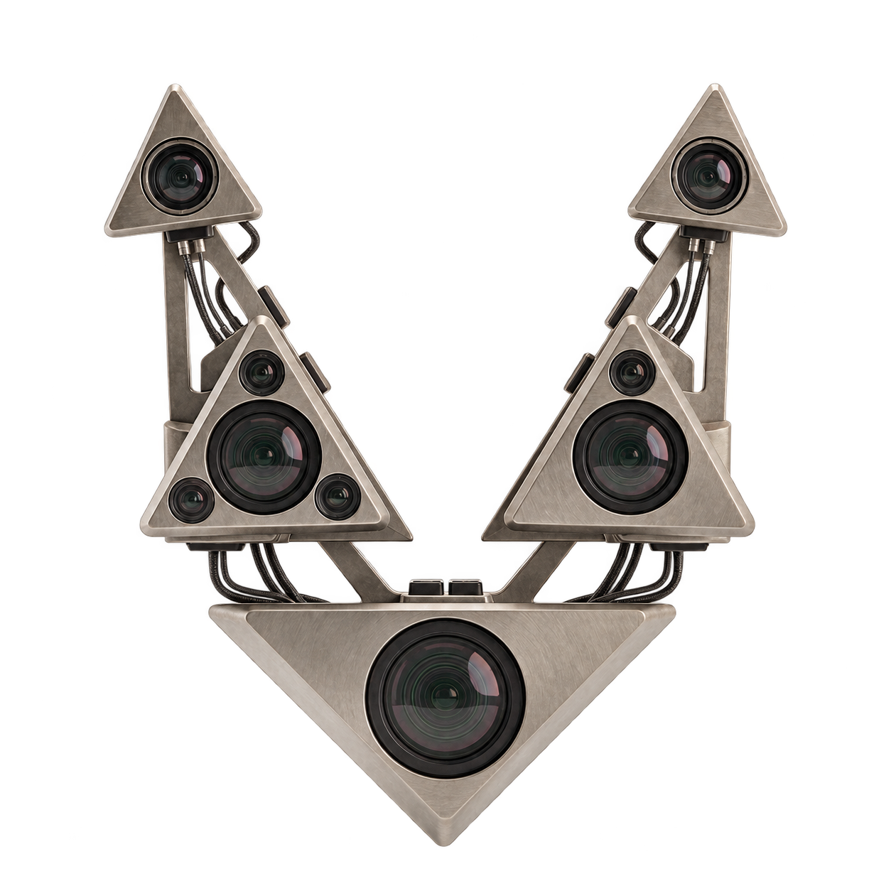

<p align="center"></p>

# DeskEye

Windows camera companion for hand gesture controls and screen-distance reminders.
Built with Python, OpenCV, MediaPipe Tasks and Tkinter.

**Beta · Windows 10/11 x64 · Greek interface only / Περιβάλλον μόνο στα ελληνικά**

## Download and run

**[Download DeskEye 0.3.0 for Windows x64](https://github.com/regaz1/DeskEye/releases/download/v0.3.0/DeskEye-0.3.0-Windows-x64.zip)**

1. Extract the entire ZIP and open `DeskEye/DeskEye.exe`.
2. Keep `_internal`, `licenses` and the other files beside the executable.
3. Close other applications using the camera, start tracking and read the first-use notice.
4. Test recognition before enabling actual audio commands.

Python and recognition models are bundled. A working DirectShow camera driver is
required separately. PS3 Eye was used during development with
[PS3EyeDirectShow](https://github.com/AllanCat/PS3EyeDirectShow); drivers are not
included. OpenTrack is not required.

[Release notes and checksum](https://github.com/regaz1/DeskEye/releases/tag/v0.3.0)
· [Οδηγός χρήσης στα ελληνικά](docs/USER_GUIDE.el.md)

Use the named Windows ZIP above for the application. GitHub's automatic
**Source code** archives contain repository files, not the executable. The
original `v0.3.0` tag predates the full source upload; use the `main` branch
([source ZIP](https://github.com/regaz1/DeskEye/archive/refs/heads/main.zip))
for the restored project.

## Features

- Volume control by pinch or closed fist, plus play/pause, mute and track gestures.
- Per-action hand selection: left, right, either hand or both hands.
- Adjustable gesture timing, sensitivity, smoothing and repeat speed.
- Camera preview with mirror control.
- Calibrated distance estimate and a discreet red “Too close” overlay.
- Optional startup with Windows and saved settings.

## Run from source

Use **Windows x64 and Python 3.14 x64** (development used Python 3.14.6).
Download and extract the `main` source ZIP, or clone this repository.

1. Run `SETUP.cmd` once. It creates `.venv`, installs dependencies and downloads
   the two MediaPipe models with SHA-256 verification. Internet is required.
2. Run `START.cmd` to launch DeskEye.
3. Calibrate distance using a measured face-to-camera distance and test gestures.

Only install `opencv-contrib-python` in this environment; do not also install
`opencv-python`, which provides the same `cv2` module.

## Project structure

```text
main.py                 Application entry point
eyedesk/                UI, tracking, gestures, settings and Windows integration
assets/                 Logo and Windows icon
models/                 Download instructions (model binaries are not in Git)
tests/                  Automated tests
docs/                   Detailed Greek user guide
licenses/               Third-party license texts
SETUP.cmd / START.cmd   Source setup and launch
BUILD.ps1               Windows build script
DeskEye.spec            PyInstaller bundle configuration
```

The internal Python package is named `eyedesk` for compatibility; the application
is called **DeskEye**. Frames are read with OpenCV, landmarks are detected with
MediaPipe, and application rules translate gestures into Windows media commands.
Tkinter provides the interface. Recognition runs in a separate process.

## Tests and build

After setup, run in PowerShell from the project folder:

```powershell
.\.venv\Scripts\python.exe -m unittest discover -s tests -v
```

To create a portable executable:

```powershell
.\BUILD.ps1
```

The build uses a separate `.build-venv` and pinned dependencies, verifies/downloads
models, and produces `dist/DeskEye/DeskEye.exe`. Distribute the **whole folder**.
The build does not sign the executable. See [test coverage and limitations](TESTING.md).

## Privacy and limitations

DeskEye does not record video. MediaPipe processes input frames on the device;
Google states that MediaPipe Tasks sends performance and usage metrics to Google.
See the [MediaPipe privacy notice](https://developers.google.com/edge/mediapipe/solutions/tasks#mediapipe-tasks-privacy-notice).

Distance is an estimate based on calibration, not a depth measurement or medical
function. Recognition depends on lighting, camera placement and visible hands.
The overlay may not appear over exclusive fullscreen applications or the secure desktop.

The beta executable is **not Authenticode-signed** and Windows may show a
SmartScreen warning. SHA-256 verifies file integrity, not publisher identity.
Earlier automated tests and a Defender scan are documented in `TESTING.md`;
they do not guarantee security or compatibility. Testing on a second clean PC
and full live validation of the frozen release remain pending.

## Feedback and licensing

[Report a problem](https://github.com/regaz1/DeskEye/issues) with your Windows
version, camera/driver, relevant settings and reproduction steps. Review logs
and screenshots for personal information before sharing them.

Development used AI coding assistance, with requirements and iterative testing
directed by the project owner.

Third-party notices are in [THIRD_PARTY_NOTICES.md](THIRD_PARTY_NOTICES.md) and
`licenses/`. No open-source license has been selected for DeskEye's own code;
the third-party licenses do not grant a license to the whole project.
